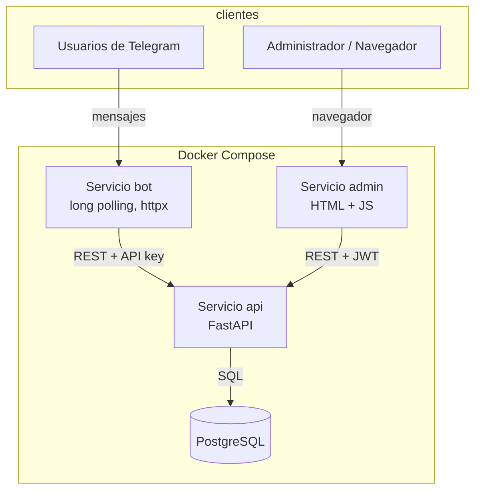
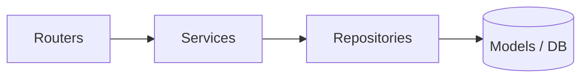
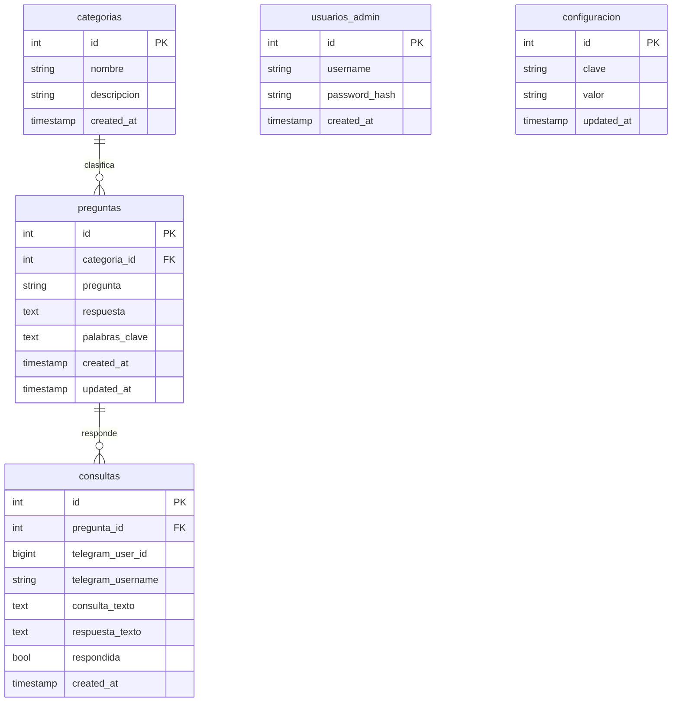

# Manual Técnico · SmartBot

## 1. Descripción general

SmartBot es un sistema de respuestas automatizadas para consultas frecuentes sobre el normativo de la Escuela de Vacaciones de la Facultad de Ingeniería (USAC). Los usuarios escriben sus dudas a un bot de Telegram y reciben respuestas obtenidas de una base de datos a través de una API REST. Un panel administrativo web permite gestionar el conocimiento del bot sin tocar el código.

## 2. Tecnologías utilizadas

| Componente | Tecnología |
|---|---|
| Backend / API REST | Python 3.11, FastAPI, Uvicorn |
| ORM | SQLAlchemy 2 |
| Base de datos | PostgreSQL 16 |
| Bot | Python, httpx (long polling sobre la Telegram Bot API) |
| Autenticación | JWT (PyJWT) y hash de contraseñas con bcrypt |
| Panel administrativo | HTML, CSS y JavaScript (nginx) |
| Orquestación | Docker y Docker Compose |
| Control de versiones | Git y GitHub |

## 3. Patrón de arquitectura

La solución sigue un modelo **cliente-servidor con una API REST central**. El bot de Telegram y el panel administrativo son dos clientes independientes que se comunican exclusivamente con la API; solo la API accede a la base de datos. Internamente, la API se organiza en una **arquitectura por capas con patrón Repository**: la capa de routers recibe las peticiones, la capa de services contiene la lógica de negocio, la capa de repositories encapsula todo el acceso a datos, y los models representan las tablas.



Capas internas de la API:



## 4. Estructura del proyecto

```
smartbot/
├── docker-compose.yml
├── .env.example
├── README.md
├── api/
│   ├── Dockerfile
│   ├── requirements.txt
│   └── app/
│       ├── main.py
│       ├── config.py
│       ├── database.py
│       ├── models.py
│       ├── schemas.py
│       ├── security.py
│       ├── dependencies.py
│       ├── seed.py
│       ├── repositories/
│       ├── services/
│       └── routers/
├── bot/
│   ├── Dockerfile
│   ├── requirements.txt
│   └── main.py
├── admin/
│   ├── Dockerfile
│   ├── index.html
│   ├── styles.css
│   └── app.js
└── docs/
    ├── manual-tecnico.md
    ├── manual-usuario.md
    └── requerimientos-no-funcionales.md
```

## 5. Modelo de datos

El sistema utiliza cinco tablas: `categorias`, `preguntas`, `usuarios_admin`, `configuracion` y `consultas`. La pregunta y su respuesta se almacenan en el mismo registro (relación 1:1). Cada pregunta pertenece a una categoría, y cada consulta puede asociarse opcionalmente a la pregunta que la respondió.



El campo `palabras_clave` almacena términos asociados a cada pregunta y es la base del algoritmo de búsqueda del bot.

## 6. API REST

Todos los endpoints de gestión requieren un token JWT (header `Authorization: Bearer`). El endpoint del bot se protege con una clave de API interna (header `X-API-Key`).

| Método | Ruta | Protección | Descripción |
|---|---|---|---|
| POST | `/auth/login` | Pública | Devuelve un token JWT |
| GET | `/categorias` | JWT | Lista categorías |
| POST | `/categorias` | JWT | Crea una categoría |
| GET | `/categorias/{id}` | JWT | Obtiene una categoría |
| PUT | `/categorias/{id}` | JWT | Actualiza una categoría |
| DELETE | `/categorias/{id}` | JWT | Elimina una categoría |
| GET | `/preguntas` | JWT | Lista preguntas |
| POST | `/preguntas` | JWT | Crea una pregunta |
| GET | `/preguntas/{id}` | JWT | Obtiene una pregunta |
| PUT | `/preguntas/{id}` | JWT | Actualiza una pregunta |
| DELETE | `/preguntas/{id}` | JWT | Elimina una pregunta |
| GET | `/configuracion` | JWT | Lista la configuración |
| GET | `/configuracion/{clave}` | JWT | Obtiene un valor |
| PUT | `/configuracion/{clave}` | JWT | Actualiza un valor |
| GET | `/consultas` | JWT | Lista el registro de consultas |
| GET | `/estadisticas` | JWT | Devuelve el resumen de uso |
| POST | `/bot/consultar` | API key | Busca, responde y registra una consulta |

## 7. Algoritmo de búsqueda

Cuando el bot recibe un mensaje, lo envía a `/bot/consultar`. El service normaliza el texto (minúsculas, sin tildes ni signos), lo divide en palabras descartando las vacías, y compara contra el texto y las palabras clave de cada pregunta, contando coincidencias. Devuelve la pregunta con mayor número de coincidencias. Si ninguna coincide, responde con el mensaje configurable `mensaje_no_encontrado`. En todos los casos, la consulta queda registrada en la base de datos.

## 8. Configuración de Docker Compose

El archivo `docker-compose.yml` levanta cuatro servicios: `db`, `api`, `bot` y `admin`. La base de datos incluye un `healthcheck`, y la API espera a que esté lista (`depends_on: condition: service_healthy`) antes de arrancar y ejecutar la carga inicial de datos. Las credenciales y el token se inyectan mediante variables de entorno desde un archivo `.env`.

## 9. Requerimientos funcionales

- RF01. El sistema permite a un usuario de Telegram enviar consultas en lenguaje natural y recibir respuestas automáticas.
- RF02. El sistema busca la respuesta más adecuada según el texto y las palabras clave de las preguntas registradas.
- RF03. El sistema responde con un mensaje configurable cuando no encuentra una respuesta.
- RF04. El sistema registra cada consulta con fecha, usuario, texto consultado, respuesta y si fue respondida.
- RF05. El panel administrativo permite iniciar sesión mediante usuario y contraseña.
- RF06. El panel permite crear, consultar, actualizar y eliminar preguntas y respuestas.
- RF07. El panel permite crear, consultar, actualizar y eliminar categorías.
- RF08. El panel permite configurar el ID del chat o grupo de Telegram.
- RF09. El panel permite configurar el mensaje de respuesta no encontrada.
- RF10. El panel muestra estadísticas de uso: consultas totales, respondidas, sin respuesta, usuarios únicos, consultas por categoría y preguntas más consultadas.
- RF11. El bot responde a los comandos `/start` y `/ayuda`.

## 10. Mejoras futuras

- Incorporar búsqueda difusa o por similitud (por ejemplo, trigramas con la extensión `pg_trgm`) para tolerar errores ortográficos.
- Permitir adjuntar imágenes o enlaces a las respuestas.
- Añadir paginación y filtros al registro de consultas.
- Implementar roles de administrador y auditoría de cambios.
- Migrar el esquema con una herramienta de migraciones como Alembic.
