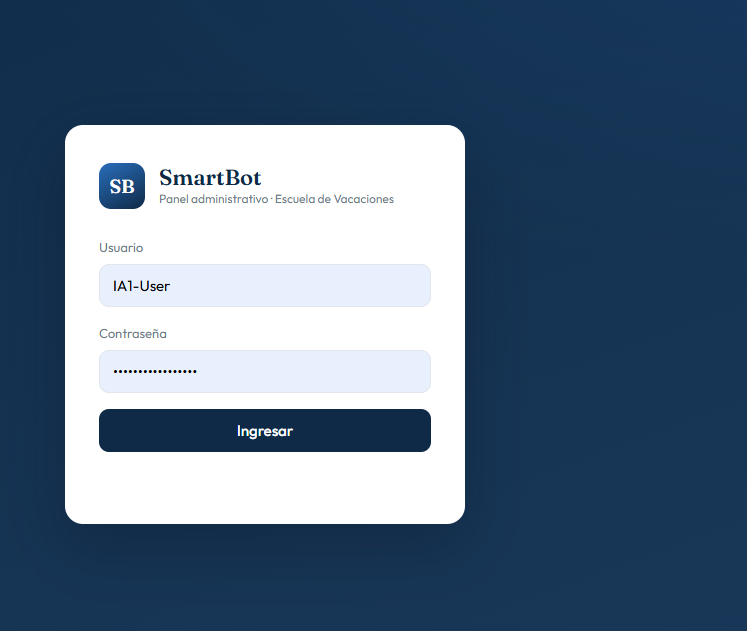
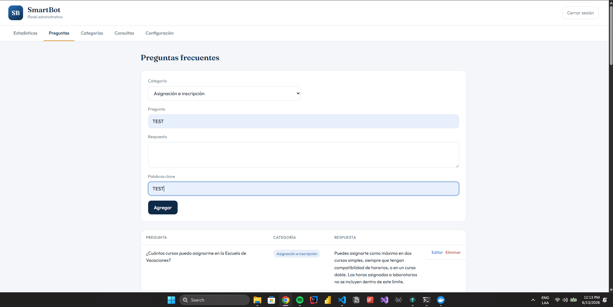
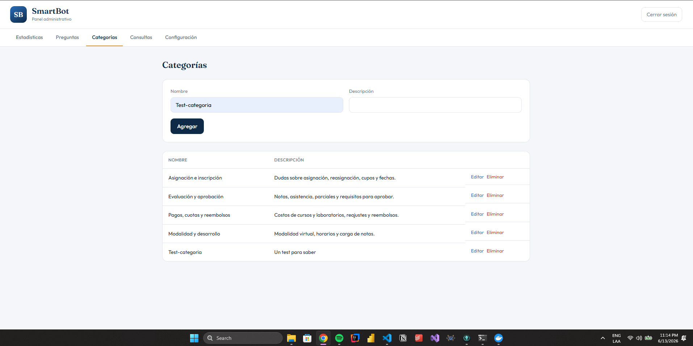
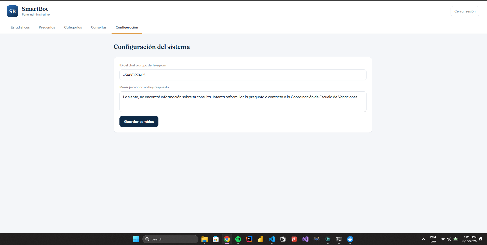
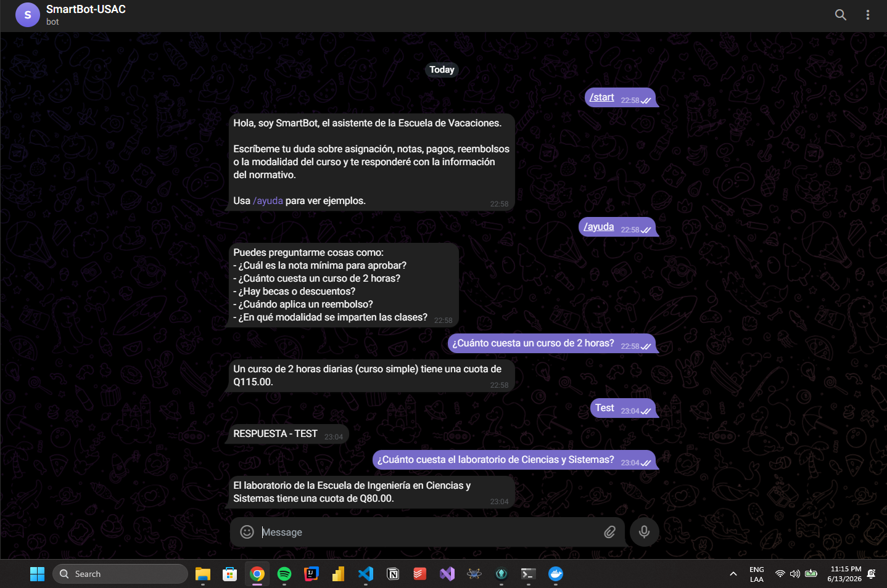

# Manual de Usuario · SmartBot

Esta guía explica cómo instalar, configurar y usar SmartBot.

## 1. Requisitos previos

- Tener instalado Docker y Docker Compose.
- Tener una cuenta de Telegram.

## 2. Crear el bot en Telegram

1. Abre Telegram y busca el contacto **BotFather**.
2. Envía el comando `/newbot`.
3. Asigna un nombre y un nombre de usuario al bot (el nombre de usuario debe terminar en `bot`).
4. BotFather te entregará un **token**. Cópialo, lo necesitarás en el siguiente paso.

## 3. Configurar el proyecto

1. Descomprime el proyecto y entra a la carpeta `smartbot`.
2. Copia la plantilla de variables de entorno:

   ```bash
   cp .env.example .env
   ```

3. Abre el archivo `.env` y coloca tu token en `TELEGRAM_BOT_TOKEN`. Cambia también `SECRET_KEY` y `BOT_API_KEY` por valores propios.

## 4. Ejecutar el sistema

Desde la carpeta `smartbot`, ejecuta:

```bash
docker compose up --build
```

La primera vez tardará un poco mientras descarga las imágenes y construye los servicios. Cuando veas el mensaje de que la API y el bot están listos, el sistema está funcionando.

## 5. Usar el bot

1. Abre Telegram y busca tu bot por el nombre de usuario que le diste.
2. Envía `/start` para ver el mensaje de bienvenida.
3. Escribe una consulta, por ejemplo:
   - *¿Cuál es la nota mínima para aprobar?*
   - *¿Cuánto cuesta un curso de 2 horas?*
   - *¿Hay becas o descuentos?*
4. El bot responderá con la información del normativo. Si no encuentra una respuesta, mostrará el mensaje de "no encontrado" configurado.

## 6. Usar el panel administrativo

1. Abre tu navegador en **http://localhost:8080**.
2. Inicia sesión con:
   - Usuario: `IA1-User`
   - Contraseña: `IA1-password@_new`

Una vez dentro, encontrarás cinco secciones:

- **Estadísticas**: resumen de uso del bot (consultas totales, respondidas, sin respuesta, usuarios únicos, consultas por categoría y preguntas más consultadas).
- **Preguntas**: alta, edición y eliminación de preguntas frecuentes. Cada pregunta tiene categoría, respuesta y palabras clave.
- **Categorías**: alta, edición y eliminación de categorías.
- **Consultas**: registro de todas las consultas que los usuarios han hecho al bot.
- **Configuración**: campo para el ID del chat o grupo de Telegram y el mensaje que se muestra cuando no hay respuesta.

## 7. Gestionar preguntas

Para agregar una pregunta:

1. Ve a la pestaña **Preguntas**.
2. Selecciona una categoría, escribe la pregunta, la respuesta y unas palabras clave separadas por espacios (estas ayudan al bot a encontrar la respuesta).
3. Presiona **Agregar**.

Para editar o eliminar, usa los botones de la fila correspondiente en la tabla.

## 8. Probar la API directamente

La API ofrece documentación interactiva en **http://localhost:8000/docs**, donde puedes probar todos los endpoints. Para los que requieren autenticación, primero usa `/auth/login`, copia el token y pégalo con el botón **Authorize**.

## 9. Detener el sistema

Para detener todos los servicios, presiona `Ctrl + C` en la terminal y luego ejecuta:

```bash
docker compose down
```

Para borrar también los datos de la base, agrega la opción `-v`.

## 10. Evidencias de funcionamiento






