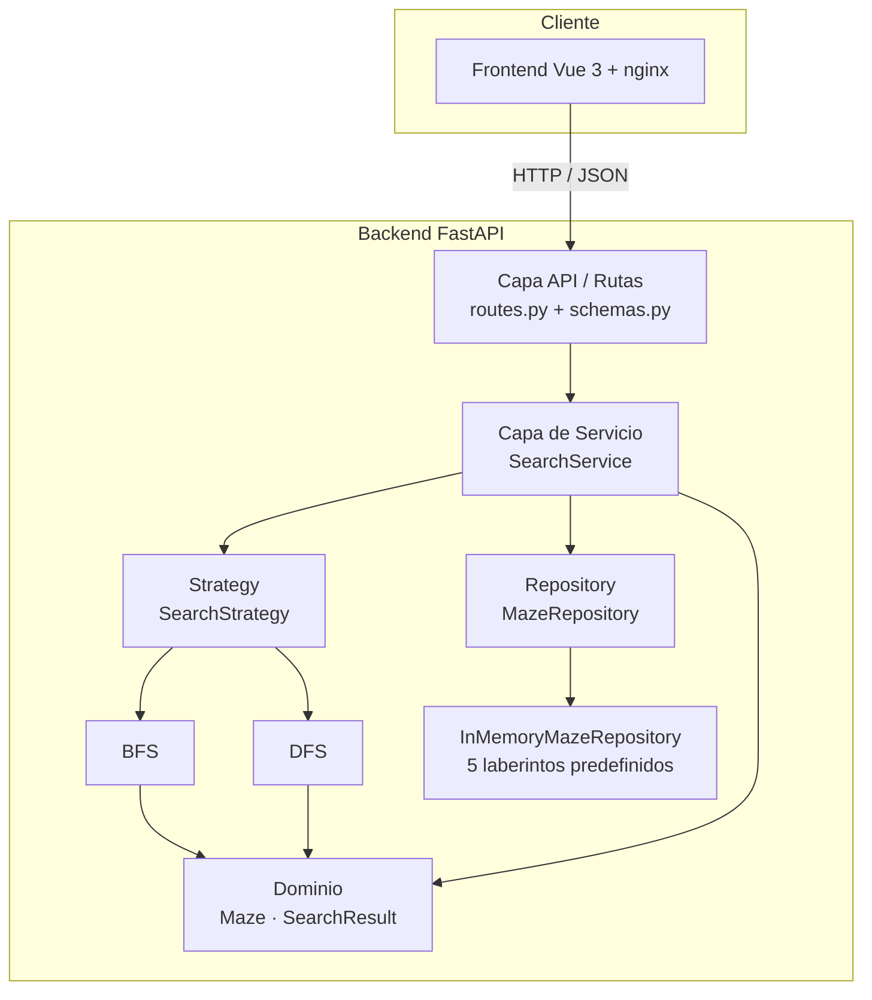

# Manual Técnico — RoboMaze

**Práctica 4 · Inteligencia Artificial 1 · Ingeniería en Ciencias y Sistemas · USAC**

---

## 1. Introducción

RoboMaze es un sistema que modela laberintos como espacios de estados y encuentra
rutas entre una posición inicial y una meta usando los algoritmos clásicos de
búsqueda no informada **Breadth-First Search (BFS)** y **Depth-First Search
(DFS)**. La lógica de búsqueda se ejecuta íntegramente en el backend; el frontend
solo se encarga de la interacción y la visualización de resultados.

## 2. Arquitectura del sistema

El sistema sigue una arquitectura cliente-servidor de dos capas desplegadas como
contenedores independientes y orquestadas con Docker Compose.

### 2.1 Patrón de arquitectura del backend

El backend implementa una **arquitectura en capas** combinada con dos patrones de
diseño: **Repository** (para el acceso a los datos de laberintos) y **Strategy**
(para los algoritmos de búsqueda intercambiables). Esto desacopla la lógica de
negocio del origen de los datos y del algoritmo concreto.



### 2.2 Flujo de una petición de búsqueda

1. El usuario configura el laberinto en el frontend y ejecuta un algoritmo.
2. El frontend envía `POST /api/search` con el laberinto y el algoritmo.
3. La capa API valida el cuerpo (Pydantic) y construye el modelo de dominio.
4. El `SearchService` valida el laberinto y selecciona la estrategia.
5. La estrategia (BFS o DFS) ejecuta la búsqueda y devuelve un `SearchResult`.
6. La API serializa el resultado y lo devuelve como JSON.
7. El frontend anima la exploración y dibuja la ruta encontrada.

## 3. Estructura del proyecto

```
robomaze/
├── docker-compose.yml          # Orquestación de los dos servicios
├── backend/
│   ├── Dockerfile
│   ├── requirements.txt
│   └── app/
│       ├── domain/models.py    # Maze, Position, SearchResult, CellType
│       ├── algorithms/
│       │   ├── base.py         # SearchStrategy (clase base abstracta)
│       │   ├── bfs.py          # Breadth-First Search
│       │   └── dfs.py          # Depth-First Search
│       ├── repositories/
│       │   ├── base.py         # MazeRepository (interfaz)
│       │   ├── memory.py       # Implementación en memoria
│       │   └── seed.py         # 5 laberintos predefinidos
│       ├── services/search_service.py
│       ├── api/
│       │   ├── routes.py       # Endpoints
│       │   └── dependencies.py # Inyección de dependencias
│       ├── schemas.py          # Schemas Pydantic (transporte)
│       └── main.py             # Aplicación FastAPI + CORS
└── frontend/
    ├── Dockerfile              # Build con Node + servir con nginx
    ├── nginx.conf              # Sirve la SPA y proxy /api
    └── src/
        ├── App.vue             # Orquestación y estado
        ├── api.js              # Cliente de la API
        └── components/
            ├── MazeGrid.vue    # Cuadrícula interactiva + animación
            ├── Toolbar.vue     # Controles de edición y ejecución
            └── MetricsPanel.vue# Métricas y comparación
```

## 4. Algoritmos implementados

Ambos algoritmos están implementados manualmente; no se utilizan librerías de
pathfinding. Operan sobre una cuadrícula con movimiento en 4 direcciones
(arriba, abajo, izquierda, derecha).

### 4.1 Breadth-First Search (BFS)

Explora el laberinto por niveles usando una **cola FIFO** (`collections.deque`).
Como todas las aristas tienen el mismo costo (un paso), **BFS garantiza la ruta
más corta** en número de pasos. Mantiene un diccionario de predecesores para
reconstruir la ruta al llegar a la meta.

- Complejidad temporal: `O(V + E)`
- Complejidad espacial: `O(V)`
- Óptimo en número de pasos: **sí**

### 4.2 Depth-First Search (DFS)

Explora tan profundo como puede por una rama antes de retroceder, usando una
**pila LIFO**. Encuentra una ruta válida si existe, pero **no garantiza la más
corta**. En muchos laberintos expande menos nodos que BFS.

- Complejidad temporal: `O(V + E)`
- Complejidad espacial: `O(V)`
- Óptimo en número de pasos: **no**

### 4.3 Métricas reportadas

Cada ejecución devuelve: si encontró ruta, la ruta completa, la **longitud de
ruta** (pasos), la **cantidad de nodos explorados**, el **tiempo de ejecución**
(ms) y el **orden de visita** de los nodos (usado para animar la exploración).

## 5. API REST

Base URL: `/api`

| Método | Ruta                | Descripción                                   |
|--------|---------------------|-----------------------------------------------|
| GET    | `/health`           | Estado del servicio.                          |
| GET    | `/algorithms`       | Lista de algoritmos disponibles.              |
| GET    | `/mazes`            | Lista de laberintos predefinidos.             |
| GET    | `/mazes/{id}`       | Un laberinto por su id.                       |
| POST   | `/search`           | Ejecuta un algoritmo sobre un laberinto.      |
| POST   | `/compare`          | Compara varios algoritmos sobre un laberinto. |

### 5.1 Ejemplo — `POST /api/search`

**Petición**
```json
{
  "maze": {
    "id": "demo",
    "name": "Demo",
    "grid": [[0,0,0],[0,1,0],[0,0,0]],
    "start": [0,0],
    "goal": [2,2]
  },
  "algorithm": "BFS"
}
```

**Respuesta** `200 OK`
```json
{
  "algorithm": "BFS",
  "found": true,
  "path": [[0,0],[1,0],[2,0],[2,1],[2,2]],
  "path_length": 4,
  "nodes_explored": 7,
  "execution_time_ms": 0.031,
  "visited_order": [[0,0],[0,1],[1,0],"…"]
}
```

### 5.2 Manejo de errores

| Código | Situación                                                         |
|--------|-------------------------------------------------------------------|
| `200`  | Búsqueda exitosa. Si no hay ruta, `found: false` (no es error).   |
| `400`  | Algoritmo no soportado.                                           |
| `404`  | Laberinto inexistente (en endpoints por id).                      |
| `422`  | Laberinto inválido (inicio/meta sobre muro, fuera de rango, etc.).|

> Nota: la ausencia de ruta válida **no** es un error HTTP. La búsqueda se
> ejecuta correctamente y devuelve `found: false`, permitiendo al frontend
> mostrar el mensaje adecuado.

## 6. Requerimientos funcionales

- **RF-01** Representar un laberinto como cuadrícula bidimensional.
- **RF-02** Definir una posición inicial y una posición objetivo.
- **RF-03** Colocar y eliminar obstáculos que bloqueen el paso.
- **RF-04** Ejecutar BFS de forma independiente y mostrar su ruta.
- **RF-05** Ejecutar DFS de forma independiente y mostrar su ruta.
- **RF-06** Mostrar la ruta completa desde el origen hasta el destino.
- **RF-07** Mostrar la cantidad de nodos explorados por cada algoritmo.
- **RF-08** Mostrar el tiempo de ejecución de cada algoritmo.
- **RF-09** Comparar resultados de BFS y DFS sobre el mismo laberinto.
- **RF-10** Animar el proceso de exploración de nodos.
- **RF-11** Proveer al menos 5 laberintos predefinidos para pruebas.
- **RF-12** Manejar el caso en que no exista ruta válida.
- **RF-13** Exponer la funcionalidad mediante una API REST.

## 7. Requerimientos no funcionales

- **RNF-01 · Rendimiento.** Las búsquedas resuelven los laberintos de prueba en
  pocos milisegundos; la cota es lineal `O(V + E)` sobre las celdas.
- **RNF-02 · Mantenibilidad.** Separación en capas y uso de los patrones
  Repository y Strategy; agregar un algoritmo nuevo (p. ej. A\*) solo requiere
  una clase y registrarla, sin tocar el servicio ni la API.
- **RNF-03 · Usabilidad.** Interfaz con edición directa por clic/arrastre,
  leyenda de colores y animación que comunica el comportamiento de cada
  algoritmo.
- **RNF-04 · Escalabilidad.** El backend es sin estado (stateless); puede
  replicarse horizontalmente detrás de un balanceador. El repositorio en memoria
  es reemplazable por otra implementación sin afectar el resto del sistema.
- **RNF-05 · Portabilidad.** Todo el sistema se levanta con un único comando
  (`docker compose up`) en Windows, Linux o macOS.
- **RNF-06 · Testeabilidad.** El núcleo cuenta con 26 pruebas automatizadas
  (dominio, algoritmos, repositorio, servicio y API).

## 8. Tecnologías

- **Backend:** Python 3.11, FastAPI, Uvicorn, Pydantic, Pytest.
- **Frontend:** Vue 3, Vite, nginx (producción).
- **Infraestructura:** Docker, Docker Compose.
- **Control de versiones:** Git + GitHub.

## 9. Posibles mejoras futuras

- Implementar **A\*** (búsqueda informada) reutilizando el Strategy Pattern.
- Generación automática de laberintos y ajuste de tamaño desde la interfaz.
- Exportación de resultados a CSV/PDF y gráficas de rendimiento comparativo.
- Guardar y cargar laberintos creados por el usuario.
- Soporte de múltiples metas y obstáculos dinámicos.
