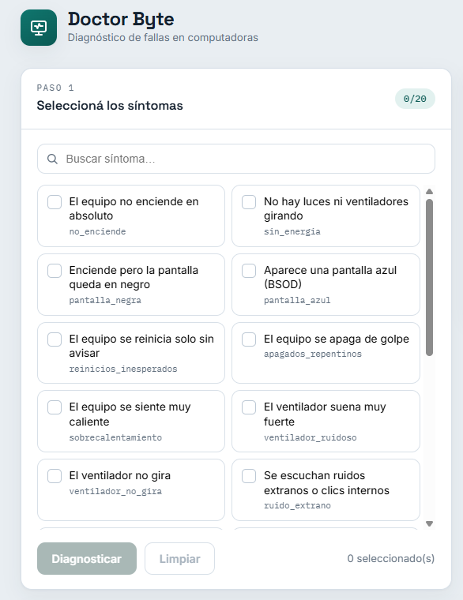
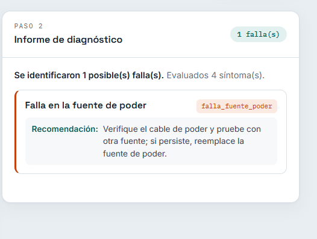
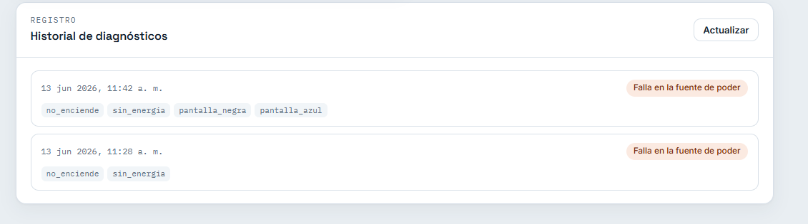

# Manual de Usuario - Doctor Byte

Doctor Byte es una herramienta que te ayuda a identificar posibles fallas en una
computadora. Vos indicás qué síntomas presenta el equipo (por ejemplo, "no
enciende" o "se reinicia solo") y el sistema te dice cuáles podrían ser las
fallas y qué podés hacer al respecto. No necesitás conocimientos técnicos para
usarlo.

---

## 1. Antes de empezar

Para usar Doctor Byte necesitás:

- Que el sistema esté en funcionamiento (lo levanta la persona que instaló el
  proyecto).
- Un navegador web actualizado (Chrome, Edge o Firefox).
- La dirección de la interfaz web, por ejemplo http://localhost:5500.

---

## 2. Acceso

Abrí el navegador y entrá a la dirección de la interfaz web. Vas a ver la
pantalla principal de Doctor Byte.

En la esquina superior derecha hay un indicador de conexión:

- "Motor conectado": todo está listo para usarse.
- "Conectando...": el sistema está iniciando; esperá unos segundos.
- "Sin conexión al backend": el sistema no está disponible. Avisale a la persona
  encargada de la instalación.

---

## 3. La pantalla principal

La pantalla se divide en tres áreas:

1. Síntomas (izquierda): la lista de síntomas que podés seleccionar.
2. Informe de diagnóstico (derecha): donde aparece el resultado.
3. Historial de diagnósticos (abajo): los diagnósticos que se hicieron antes.

---

## 4. Cómo hacer un diagnóstico

### Paso 1: Seleccioná los síntomas

En el área de la izquierda, tocá los síntomas que presenta la computadora. Cada
síntoma que seleccionás se marca con un check y queda resaltado. Podés
seleccionar todos los que quieras.

Si la lista es larga, usá el cuadro de búsqueda para filtrar. Por ejemplo,
escribí "pantalla" para ver solo los síntomas relacionados con la pantalla.

El contador en la parte superior te muestra cuántos síntomas llevás
seleccionados.

### Paso 2: Solicitá el diagnóstico

Cuando termines de seleccionar, presioná el botón Diagnosticar. Mientras el
sistema analiza, el botón muestra "Analizando...".

### Paso 3: Leé el informe

El resultado aparece en el área de la derecha. Para cada posible falla vas a
ver:

- El nombre de la falla.
- Una recomendación con lo que podés hacer para resolverla.

Si querés empezar de nuevo, presioná Limpiar: se borran los síntomas
seleccionados y el informe actual (el historial no se borra).

---

## 5. Cómo interpretar el resultado

- Si el sistema encuentra una o más fallas, las lista con su recomendación.
  Tené en cuenta que es un diagnóstico preliminar: orienta sobre la causa
  probable, pero no reemplaza la revisión de un técnico.

- Si no encuentra ninguna falla, te muestra un mensaje indicándolo. Esto suele
  pasar cuando se seleccionan pocos síntomas o síntomas que no coinciden con un
  patrón conocido. Probá agregar más síntomas que describan mejor el problema.

---

## 6. Historial de diagnósticos

En la parte inferior de la pantalla está el historial. Cada vez que hacés un
diagnóstico, este queda registrado y aparece en la lista, con el más reciente
arriba. De cada diagnóstico podés ver:

- La fecha y la hora en que se hizo.
- Las fallas detectadas (o la indicación de que no hubo fallas).
- Los síntomas que se evaluaron.

El historial se mantiene aunque cierres y vuelvas a abrir la página. Si querés
recargarlo manualmente, usá el botón Actualizar.

---

## 7. Notificaciones por Telegram

Si la persona que instaló el sistema configuró Telegram, cada diagnóstico que
hagas también llega como mensaje a un chat de Telegram. El mensaje incluye los
síntomas evaluados, las fallas encontradas y las recomendaciones. No tenés que
hacer nada de tu lado: las notificaciones se envían solas.

---

## 8. Mensajes y avisos comunes

| Lo que ves                              | Qué significa                                  |
|-----------------------------------------|------------------------------------------------|
| "Sin conexión al backend"               | El sistema no está disponible. Contactá al encargado. |
| El botón Diagnosticar está deshabilitado| No hay ningún síntoma seleccionado todavía.    |
| "No se identificaron fallas..."         | Los síntomas elegidos no coinciden con un patrón conocido. Probá agregar más. |
| "No se pudo contactar al backend..."    | El sistema dejó de responder durante el diagnóstico. Reintentá en unos segundos. |

---

## 9. Preguntas frecuentes

Necesito instalar algo para usarlo.
No. Solo necesitás un navegador y la dirección de la interfaz.

El diagnóstico es definitivo.
No. Es una orientación preliminar basada en los síntomas que indicaste. Para
reparaciones, consultá con un técnico.

Puedo seleccionar varios síntomas a la vez.
Sí, y es recomendable. Mientras más síntomas reales selecciones, más preciso
es el diagnóstico.

Se borra el historial si cierro la página.
No. El historial se guarda y sigue disponible cuando vuelvas a entrar.